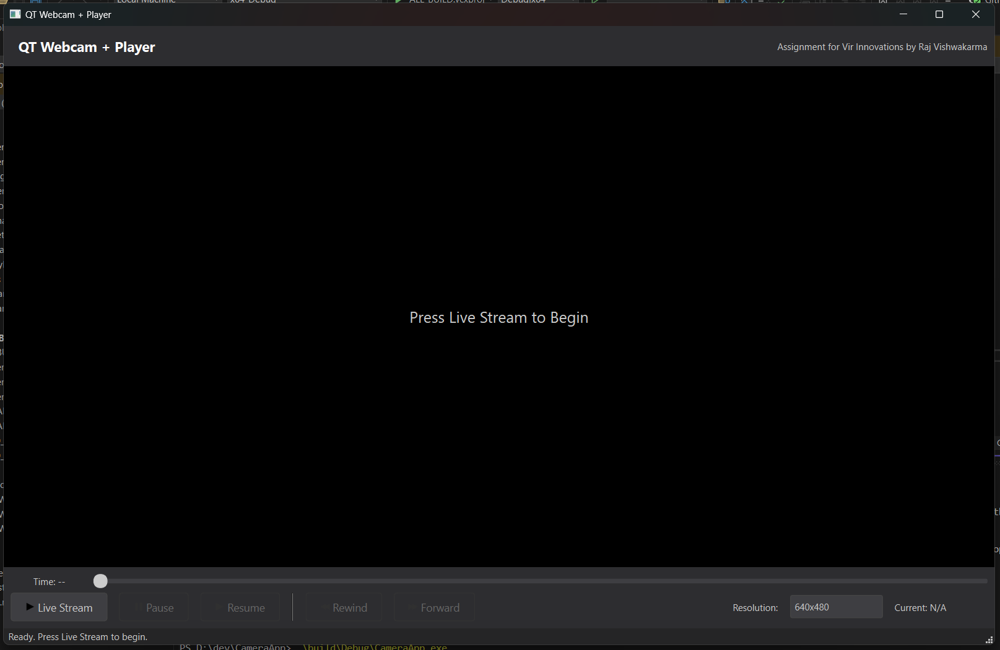

# QT Webcam + Player

A professional, feature-rich webcam viewer and player application built with C++ and the Qt framework, developed as an assignment for VIR Innovations. The application provides a live camera feed, buffered playback controls, and a modern, minimal user interface.

## Demo

Application Screenshot ⬇️


Live Youtube Demo ⬇️

[](https://www.youtube.com/watch?v=Xmc5whRvbkQ)

## Features

This application includes a wide range of features to meet and exceed the project requirements:

* **Live Camera Feed:** Displays a real-time video stream from the default system camera in a resizable window.
* **Buffered Playback:** The application continuously stores the last ~10 seconds of the live feed in a memory buffer.
* **Advanced Playback Controls**:
    * **Live Stream:** Start the live camera feed or return to it from playback mode.
    * **Pause:** A dual-function button to pause the live feed (entering playback mode) or pause the buffered playback itself.
    * **Resume:** A dedicated button to resume playback of the buffered video.
    * **Forward & Rewind:** Skip forward or backward through the buffered video by a set number of frames.
* **Interactive Timeline:** A slider allows for precise seeking within the buffered video history when paused.
* **Camera Configuration:**
    * Change the camera's resolution on-the-fly from a dropdown menu with common options (e.g., 640x480, 1280x720, 1920x1080).
    * The UI displays the current active resolution.
* **Professional User Interface:**
    * A clean, minimal, and professional dark theme inspired by modern development tools.
    * Clear iconography and text labels on all buttons for maximum usability.
    * Helpful tooltips to explain the function of each control.
* **Robust Error Handling:** The application gracefully handles potential runtime errors, such as the inability to access the camera or failure to set a resolution, and displays informative messages in the status bar without crashing.
* **Automated Dependency Deployment:** The build system is configured to automatically copy all required Qt and OpenCV DLLs next to the executable, making the application portable and easy to run without manual setup.

## Tech Stack

* **Language:** C++ (using the C++17 standard)
* **UI Framework:** Qt 6
* **Computer Vision:** OpenCV 4
* **Build System:** CMake
* **Version Control:** Git / GitHub

## Project Requirements

This project was built to fulfill the specifications outlined in the assignment document. Below are the key requirements and how they were met.

### Functional Requirements

> **1. Camera Feed Display:** The application should display the live camera feed in a resizable window. The feed should be captured using the OpenCV library.

* ✅ **Met:** The application uses `cv::VideoCapture` to capture the feed and displays it in the main window, which is fully resizable.

> **2. Playback Controls:** The application must include the following controls: Play, Pause, Resume, Forward, Rewind.

* ✅ **Met:** All five controls are implemented. Play (Live Stream), Pause, and Resume manage the state of the live feed and buffered playback. Forward and Rewind operate on the buffered timeline.

> **3. Camera Feed Settings:** The user should be able to configure the resolution of the camera feed. Options may include common resolutions such as 640x480, 1280x720, and 1920x1080. The application should display the current resolution being used.

* ✅ **Met:** A dropdown menu allows users to select from these resolutions. The "Current" label updates to reflect the actual resolution set by the camera driver.

> **4. Error Handling:** The application should handle errors such as the inability to access the camera or invalid resolution settings. If an error occurs, the application should notify the user with a message.

* ✅ **Met:** The application shows a `QMessageBox` pop-up if the camera cannot be accessed. It shows messages in the status bar for non-critical errors like failing to grab a frame, and the resolution-changing logic is robust against driver failures.

### Deliverables

> **1. A GitHub repository with the source code...**

* ✅ **Met:** This repository contains the full source code.

> **2. A CMake-based build system to compile the project.**

* ✅ **Met:** The project uses a `CMakeLists.txt` file that configures the project and handles all dependencies.

> **3. A README file that explains how to set up, build, and run the application.**

* ✅ **Met:** This document serves as the README file.

> **4. A simple UI with the necessary playback controls... and a section for camera feed settings...**

* ✅ **Met:** The final UI includes all specified controls and settings in a clean, professional layout.

## Setup & Installation (Windows 11)

Follow these steps to set up the development environment and all necessary dependencies.

### 1. Install Core Tools

* **Visual Studio 2022:**
    * Download the Community version from the [official Visual Studio website](https://visualstudio.microsoft.com/vs/community/).
    * During installation, you **must** select the **"Desktop development with C++"** workload.

* **Git for Windows:**
    * Download and install from [git-scm.com](https://git-scm.com/download/win).
    * You can use the default settings during installation.

* **CMake:**
    * Download the latest installer from the [official CMake website](https://cmake.org/download/).
    * During installation, ensure you select the option **"Add CMake to the system PATH for all users"**.

### 2. Install Dependencies (vcpkg & Qt)

* **vcpkg (for OpenCV):**
    1.  Open PowerShell and choose a directory to install `vcpkg` (e.g., `C:\`).
    2.  Clone the repository:
        ```powershell
        git clone [https://github.com/microsoft/vcpkg](https://github.com/microsoft/vcpkg)
        cd vcpkg
        ```
    3.  Run the bootstrap script:
        ```powershell
        .\bootstrap-vcpkg.bat
        ```
    4.  Install the 64-bit OpenCV library. This may take some time.
        ```powershell
        .\vcpkg.exe install opencv4:x64-windows
        ```

* **Qt 6 (MSVC Version):**
    1.  Download and run the [Qt Online Installer](https://www.qt.io/download-qt-installer).
    2.  Sign in or create a Qt account.
    3.  On the "Installation options" screen, select **"Custom Installation"**.
    4.  On the "Customize" screen, find the latest Qt version (e.g., Qt 6.9.1) and check the box for the **"MSVC 2022 64-bit"** component. This is critical to match your Visual Studio installation.

## How to Build and Run

1.  **Clone the Repository**
    ```bash
    git clone [https://github.com/rajvishwakarma1/CameraApp](https://github.com/rajvishwakarma1/CameraApp)
    cd CameraApp
    ```

2.  **Configure with CMake**
    Open PowerShell and run the following command from the project's root directory. **Remember to replace the placeholder paths** with the actual paths to your `vcpkg` and `Qt` installations.

    ```powershell
    cmake -B build -S . -DCMAKE_TOOLCHAIN_FILE=C:\vcpkg\scripts\buildsystems\vcpkg.cmake -DCMAKE_PREFIX_PATH=C:\Qt\6.9.1\msvc2022_64
    ```

3.  **Compile the Project**
    This command will compile the source code and automatically run the deployment scripts to copy all necessary DLLs into the build folder.
    ```powershell
    cmake --build build
    ```

4.  **Run the Application**
    Navigate to the `build/Debug` directory and run the executable directly. **No need to set the PATH variable.**
    ```powershell
    .\build\Debug\CameraApp.exe
    ```

## Future Scope

While the current version fulfills all requirements, the following features could be added in the future:

* **Save/Record Video to File:** The feature we discussed but decided to leave for later. This would involve using OpenCV's `VideoWriter` class, likely in a separate thread to prevent UI lag.
* **Multiple Camera Support:** Add a feature to detect all connected cameras and allow the user to switch between them.
* **Real-time OpenCV Filters:** Implement a menu to apply real-time video effects, such as Grayscale, Edge Detection (Canny), or Blurring.
* **Saving Snapshots:** Add a button to capture the current frame and save it as a JPEG or PNG image.

## Author

* **Raj Vishwakarma**

### Acknowledgments

* An assignment for **VIR Innovations**.
